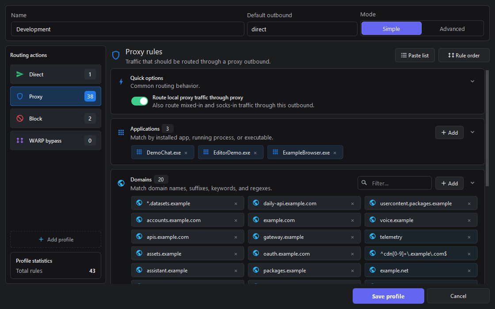
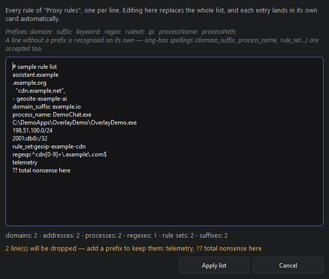
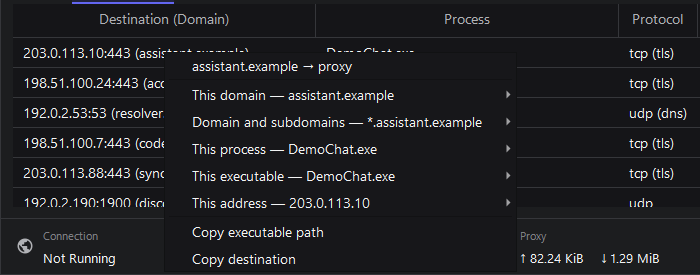

<p align="center">
  
</p>

<h1 align="center">Throned</h1>

<p align="center">
  A Qt desktop proxy client powered by sing-box and Xray —<br>
  my personal, unofficial fork of <a href="https://github.com/throneproj/Throne">Throne</a>.
</p>

<p align="center">
  <a href="https://github.com/troshkindm/throned/releases"></a>
  <a href="LICENSE"></a>
  
</p>

<p align="center">
  
</p>

---

## What Throned adds

Everything Throne does, plus:

**Routing**
- Simple and Advanced modes over one rule document.
- Paste a whole rule list as plain text.
- Application picker: installed apps, running processes, or any executable.
- Right-click a live connection to turn it into a rule.
- Send a rule bucket through a named profile or chain, not just proxy/direct/block.
- Quick menu on the status bar: profile, default outbound, rules on/off.

**TUN and DNS**
- Windows TUN self-loop guard.
- Transition guard: no leak in the gap between stopping and starting a profile (Windows).
- Apply your DNS settings over a full-config profile's own.
- Rule-set, GeoIP and GeoSite downloads follow the active proxy.

**DPI bypass**
- Its own screen: TLS spoof, decoy SNI, QUIC blocking, target rule sets — also per routing rule.

**Testing and monitoring**
- UDP latency and jitter probe, with its own column.
- **Site reachability** — a grid of your profiles against the sites you actually use, so a node is judged by what it opens rather than by one latency number.
- Ping monitor on the graph: up to three targets, direct path measured beside the proxy.
- URL test, speed test and IP resolution over a multi-row selection.
- Search, sort and close live connections; filters and ordering survive restarts.
- Themed proxy/direct throughput graph in the collapsible activity panel.

**Subscriptions**
- Allowance and expiry as a meter on the group tab, warning colour on the worse of the two.
- Click that meter for the plan: traffic, days left, refresh cycle, the provider's links.
- The provider's announcement as a dismissible strip; it returns only when the text changes.
- Per-group refresh cycle, taken from `profile-update-interval` or set by hand.
- Tray notice once per threshold: seven days, three, one, and ninety percent of the traffic.
- Falls back to the provider's `fallback-url` when the subscription address does not answer.

**Interface**
- Redesigned two-line server list with exit endpoint, live metrics and configurable columns.
- Favourites across every group, plus optional search across every group.
- Quick Add accepts subscription and profile links or opens manual group/profile creation.
- Frameless native window, five core palettes and self-contained custom skins.
- Log filtered by level, on a hanging timestamp gutter.
- Status strip that no longer reflows as numbers change.

**Operating it**
- Reconnect on start picks the last profile, the fastest measured one, or any at random.
- **Copy Diagnostics** — one paste for a bug report, secrets masked.
- Update checks and downloads follow the running profile, with in-window progress and explicit restart-to-install.
- Release notes follow the interface language when the release provides a translation.
- Control CLI over a local socket.

<details>
<summary><b>More screenshots</b></summary>

<br>

Routing, Simple mode — rules sorted into application, domain, rule-set and
address cards:



Advanced mode — the real ordered rule list, first match wins:


Paste a rule list as text:



A rule built from a live connection:



Settings:


> Rendered from the application itself. Every server, host and path is
> placeholder data using the reserved documentation ranges from RFC 5737.

</details>

<details>
<summary><b>Themes</b></summary>

<br>

Five built-in themes, in **Settings → Appearance**. The background ramp stays
near-neutral in all of them and the chroma budget goes to the accent, which
keeps text edges crisp.

| Midnight | Graphite |
| --- | --- |
|  |  |

| Ocean | Violet | Ember |
| --- | --- | --- |
|  |  |  |

</details>

<details>
<summary><b>Control CLI</b></summary>

<br>

A running Throned can be driven from the command line. The command travels to
the open window over a local socket, runs against the same database the
interface uses, and the answer comes back on stdout.

```sh
throned --cli status
throned --cli route add example.com --via proxy
throned --cli route app add discord.exe --via direct
throned --cli route rules            # the ordered rule list; first match wins
```

Every command is also addressable as JSON, replying `{"ok":true,"data":{…}}` or
`{"ok":false,"error":"…"}`:

```sh
throned --cli '{"cmd":"routing.set_default","outbound":"proxy"}'
throned --cli '{"cmd":"logs","lines":50,"contains":"reject"}'
```

`routing.export` hands over the whole profile losslessly and `routing.import`
takes an edited one back; `{"cmd":"schema"}` describes the command surface and
the rule format, both generated from the code that parses them. Routing edits
restart the core — pass `"apply": false` to batch several and finish with
`routing.apply`.

The socket is restricted to the current user; anything able to reach it can
change where traffic goes. `throned --cli help` prints the whole reference.

</details>

---

## Downloads

Stable builds are on the
[Releases](https://github.com/troshkindm/throned/releases) page.

| Platform | Package |
| --- | --- |
| Windows x64 | Installer EXE (recommended), portable ZIP |
| Linux x64 / ARM64 | Portable ZIP |
| Debian / Ubuntu x64 / ARM64 | DEB, bundled Qt (recommended) or system Qt |
| Fedora / openSUSE x64 / ARM64 | RPM, bundled Qt (recommended) or system Qt |
| Windows ARM64, legacy Windows | Planned |
| macOS | Build from source; upstream-compatible, not CI-tested here |

TUN mode needs administrator privileges on Windows and elevated network
capabilities on Linux. On first launch an existing Throne configuration is
copied in when no Throned database exists yet, and `throne://` links keep
working. A portable copy — one that keeps its config beside the exe — does not
claim the system-wide handler on its own; register it from Basic Settings.

<details>
<summary><b>Building</b></summary>

<br>

The authoritative recipes are in [.github/workflows](.github/workflows) — they
build `ThronedCore`, the Qt application and the packages in clean runners.

The UI preview harness builds against Qt alone, with no database, core process
or networking:

```sh
cmake -S tools/ui-demo -B build-ui
cmake --build build-ui
```

The application also renders its real screens headlessly
(`--route-editor-preview`, `-ui-preview`), which is how the screenshots above
are made. See [docs/ui-redesign.md](docs/ui-redesign.md).

</details>

---

## About this fork

I maintain Throned to fix problems that affect me directly, test the changes on
Windows and Linux, and publish installers without waiting for a particular
upstream release. Upstream changes are merged from
[throneproj/Throne](https://github.com/throneproj/Throne) periodically, and fork
patches are kept small enough to rebase, retire, or propose upstream.

AI-assisted tools are used extensively while writing, reviewing and documenting
changes. Releases are tested before publishing, but this is a personal
best-effort project — not an official Throne build and not a promise of support.
For the upstream project and its support channels, use
[Throne](https://github.com/throneproj/Throne). Throned is provided as-is,
without warranty.

Versioning is ordinary [SemVer](https://semver.org/), and each release note
states which Throne version or commit it is based on. Bug reports should include
the Throned version, OS, TUN settings, routing profile, and the log around the
problem.

---

## Versions

| Component | Version |
| --- | --- |
| sing-box | v1.14.0-rc.5 (throneproj fork) |
| Xray-core | throneproj fork |
| sing-tun | v0.9.0-beta.4 |
| Qt | 6.11.1–6.11.2 (target-dependent) |
| Go | 1.26.7 |

Exact build stamps are printed in the log at startup. Protocols come from
sing-box and Xray: VLESS, VMess, Trojan, Shadowsocks, SOCKS, HTTP(S), TUIC,
Hysteria, Hysteria2, AnyTLS, ShadowTLS, Snell, WireGuard/AmneziaWG, SSH, Mieru,
NaiveProxy, Juicity, TrustTunnel, custom outbounds and configs, chains, and
extra cores.

Built on [Throne](https://github.com/throneproj/Throne),
[sing-box](https://github.com/SagerNet/sing-box),
[Xray-core](https://github.com/XTLS/Xray-core), Qt, and the other projects listed
in the source tree. Licensed under [GPL-3.0](LICENSE).
