# Throned UI redesign preview

This branch is the reviewable foundation for the first post-1.1 UI release. The preview is built with Qt Widgets, the same toolkit as Throned, and intentionally runs without a database, core process, TUN interface, updater, or system-proxy changes.

## Screens

### Main window

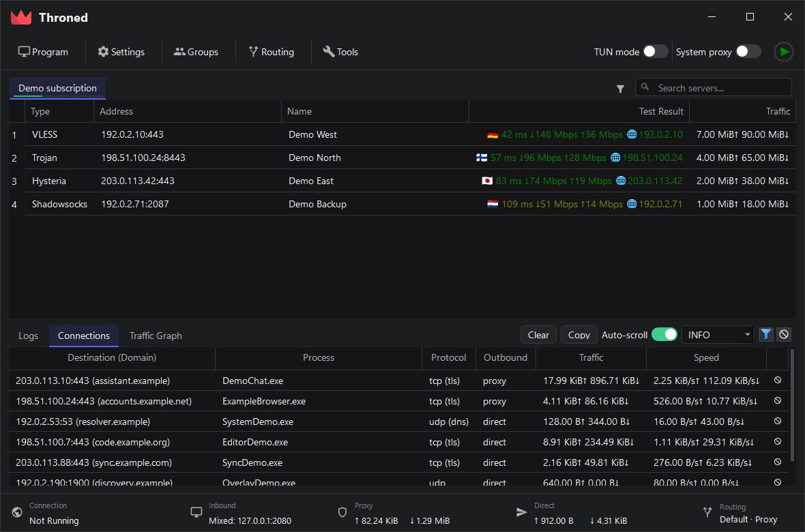

The main window has three explicit bottom-bar states: the connected profile, a
multi-selection action bar, and progress for a running batch operation. URL
test, speed test, and outbound-IP resolution operate on the preserved table
selection instead of replacing the connection status with an ambiguous toast.

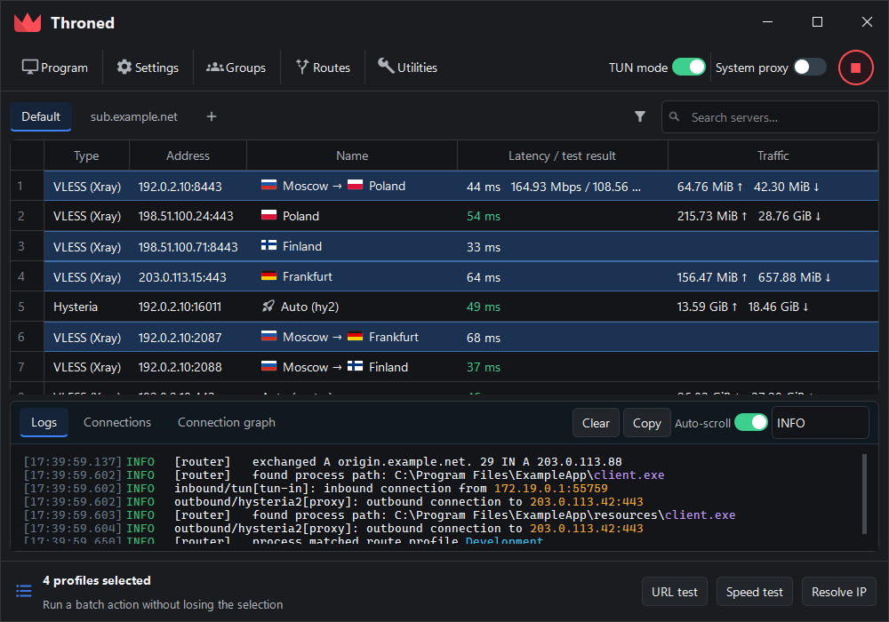

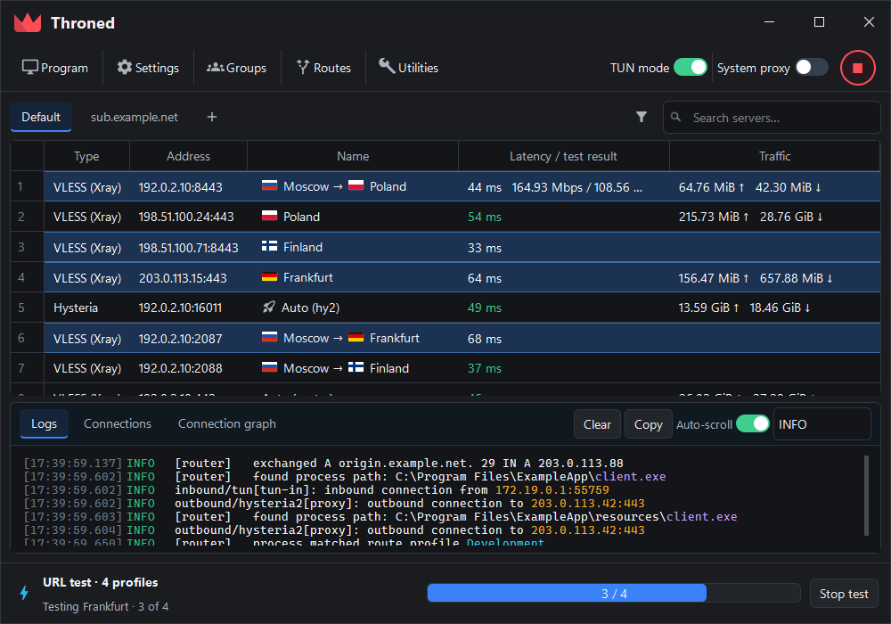

### Themes

Every theme is built from the same semantic tokens in
`include/ui/setting/ThronedPalette.hpp`. The background ramp stays close to
neutral in all five: a tinted window at low luminance contrast makes text edges
read as soft, so the chroma budget is spent on the accent family instead. Each
theme keeps one clear lightness ladder — recessed surface, window, raised
control, hover, hairline — so panels separate without heavy borders.

| Midnight | Graphite |
| --- | --- |
| 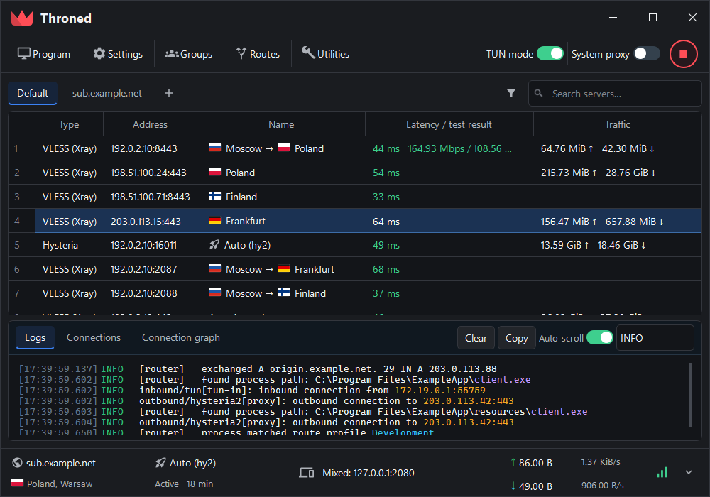 | 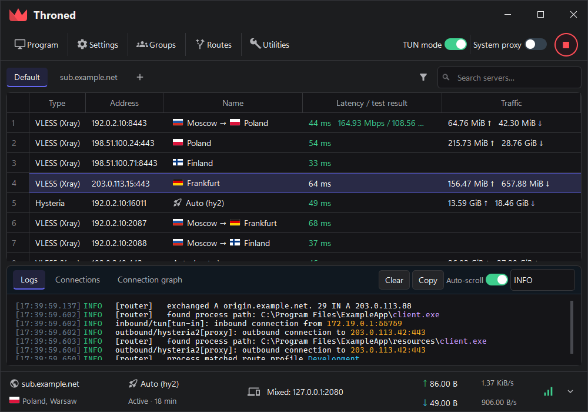 |

| Ocean | Violet | Ember |
| --- | --- | --- |
| 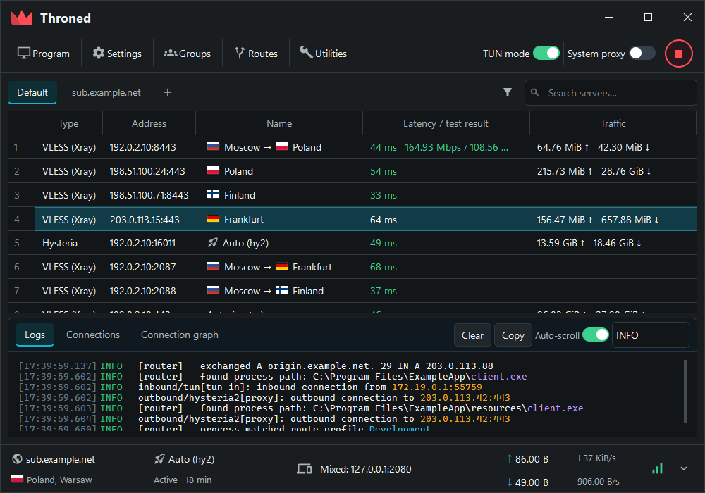 | 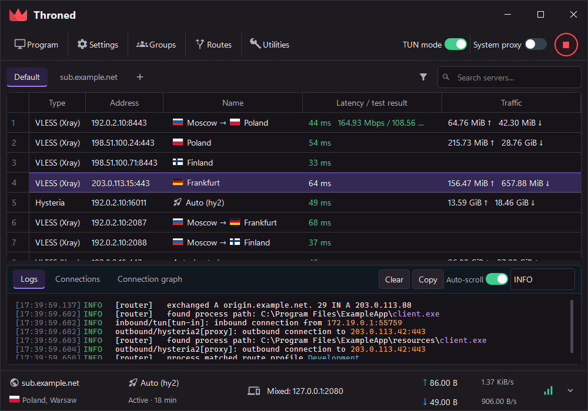 | 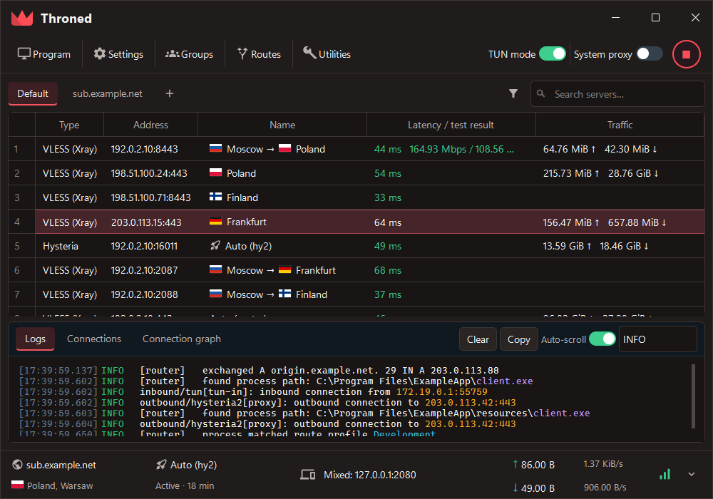 |

The preview renders any of them with `--theme midnight|graphite|ocean|violet|ember`.

### Settings foundation

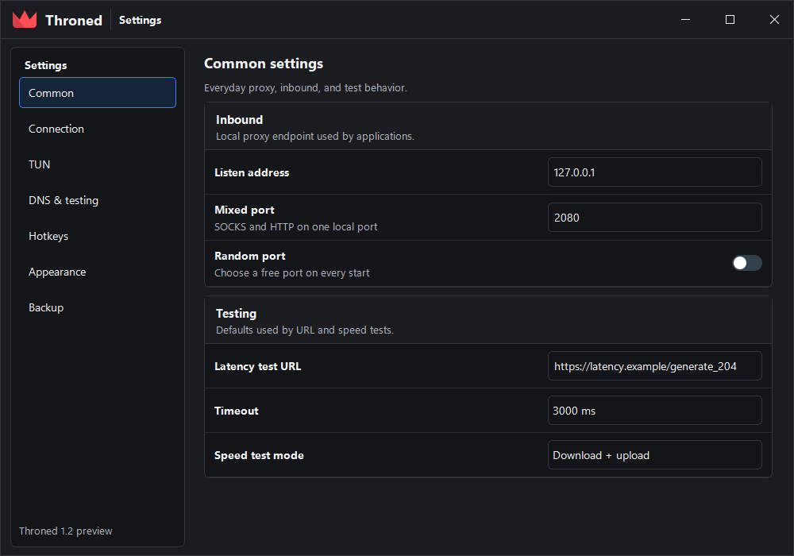

### Routing — Simple

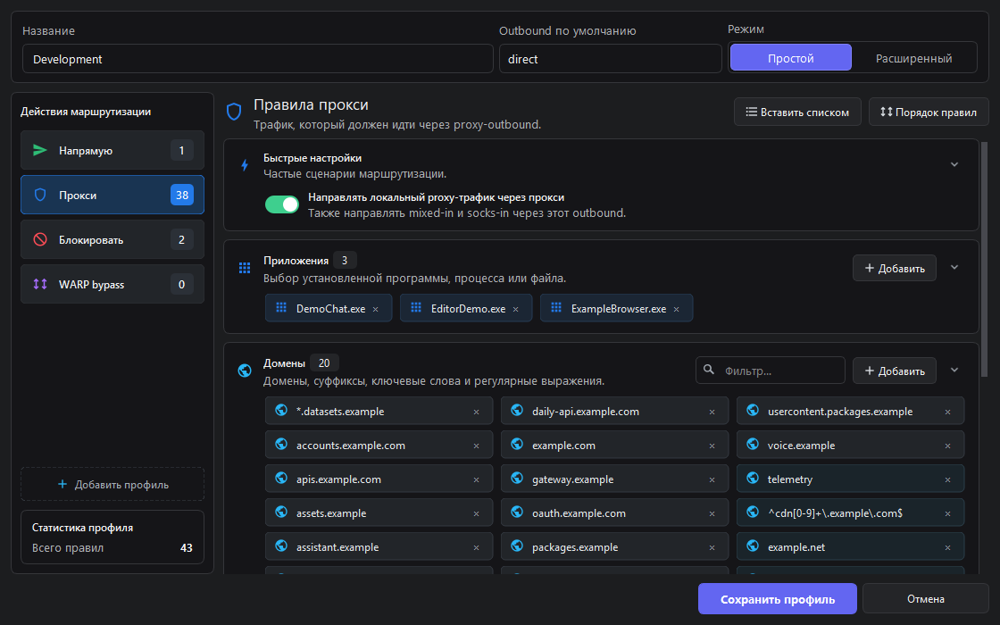

### Routing — Advanced

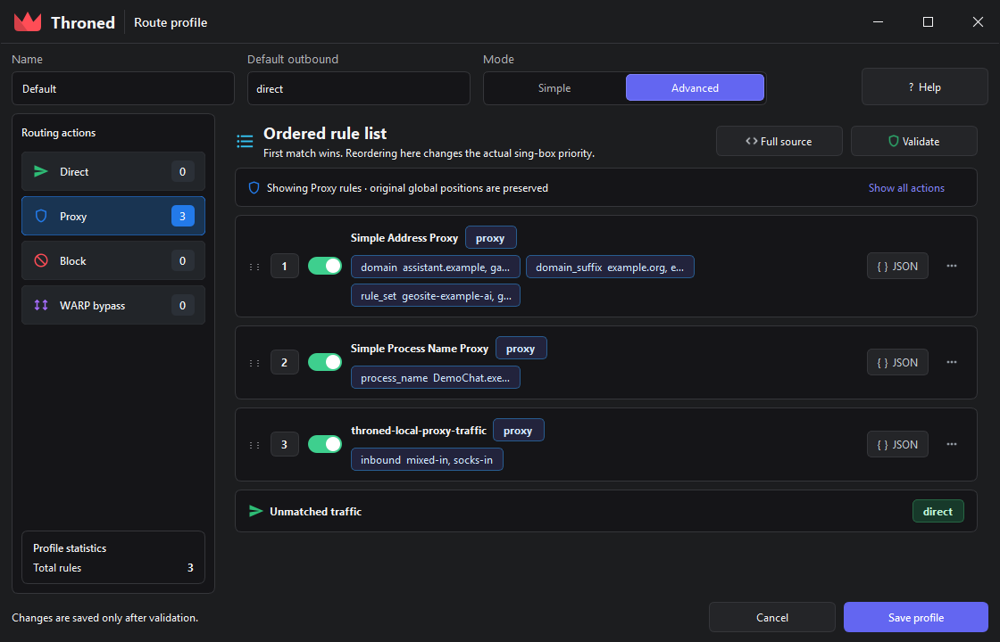

The per-rule detail page keeps the original lossless editor behind the ordered
list:

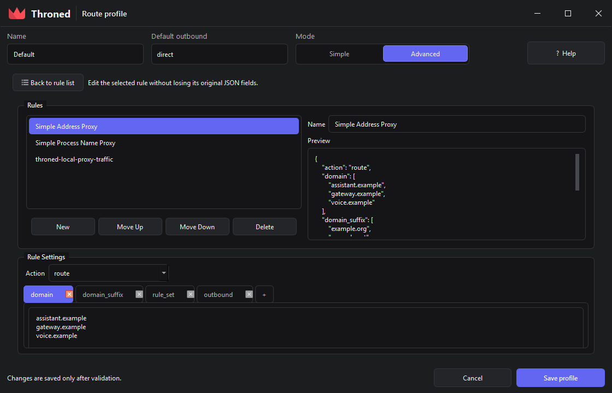

## Interaction model

- Routes opens directly from the main command bar.
- Simple groups common matchers into application, domain/rule-set, process, network, and raw-rule cards.
- The action sidebar is a filter and summary, not a replacement for rule priority.
- Advanced exposes the real ordered rule list. The first matching rule wins.
- Unknown imported fields remain as opaque JSON in their original position and receive a visible `Preserved JSON` marker.
- Simple and Advanced will edit one shared versioned route document. Switching modes must never delete, regroup, or silently reorder rules.
- Selecting several profile rows reveals contextual batch actions. Starting a
  URL test changes that same region into progress and cancellation controls.
- Logs wrap at the window edge with a hanging timestamp/level gutter. IPs and
  ports use the warning accent; only executable names use the process accent.

## Component coverage audit

The preview components were checked against the existing Qt forms rather than
only the main-window mockup:

| Existing area | Reused foundation | Required specialized component |
| --- | --- | --- |
| Basic, TUN, DNS, and hotkey settings | Title bar, settings sidebar, form sections, fields, toggles, help text | Key-sequence recorder and validation summary |
| Group and subscription management | Sidebar/list rows, pills, contextual action bar | Subscription update progress and per-group error state |
| Profile editors (VLESS, Hysteria, WireGuard, SSH, etc.) | Form sections, segmented modes, chips, advanced/raw JSON surface | Protocol-specific nested form and secret-field treatment |
| Routing | Action sidebar, rule cards, condition chips, ordered advanced list | Lossless rule document and app/process picker |
| Runtime and traffic statistics | Tabs, data table, status cards, time-range field | Chart card, legends, empty/loading/error states |

This means the palette and compact controls can be shared application-wide,
but the redesign still needs a small set of domain components. It should not
be implemented as one global stylesheet pasted over every legacy `.ui` file.

## Production migration

1. Extract semantic design tokens and reusable Qt Widgets components from the preview.
2. Introduce a versioned route-document model and lossless legacy migration before replacing the current editor.
3. Add a route compiler and round-trip tests for order, nested conditions, numeric values, and unknown JSON.
4. Replace the routing editor, then migrate the main shell and remaining settings dialogs incrementally.
5. Add an application picker backed by recently observed processes, running processes, installed apps, and manual executable selection on Windows and Linux.

The standalone preview remains useful throughout the migration: CI builds a runnable Windows executable and renders EN/RU screenshots without bringing up networking side effects.

## Rendering the shipped screens

The screenshots above of routing and the main window come from the application
itself, not from the mockup, so a layout regression shows up in them. Both modes
exit after writing their PNGs.

```sh
# routing editor, real widgets, throwaway in-memory profile
throned --route-editor-preview [--advanced] [--detail] [--paste] \
        [-lang ru] [-theme graphite] --output routes.png

# main window on an isolated configuration, with sample connections
throned -lang en -theme graphite -ui-preview <prefix>
```

`-ui-preview` writes `<prefix>-window.png`, `<prefix>-menu.png`,
`<prefix>-menu-in-place.png` and `<prefix>-submenu.png`. It always runs against
an automatically created temporary database containing only reserved example
domains and RFC 5737 documentation addresses; persisted profiles and
subscriptions are never opened or copied.

`-lang` and `-theme` also work on a normal launch and override the stored
choices for that run only.
